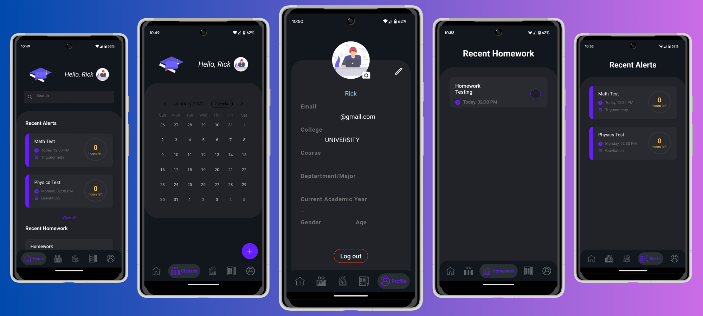

<h2 align=center> 🎓 Friday </h2>

# Friday - Your Personal Class Assistant

Friday is an innovative application designed to help you stay organized and never miss an assignment deadline or upcoming test again. With the shift to online education due to the pandemic, keeping track of assignments, exams, and other academic tasks can be overwhelming. 

	
 
opinion.

<h2 align=center> "Friday - Your Personal Class Assistant, It'll never let you miss another assignment deadline or any upcoming test."
	
	

&nbsp;
  
  
<h1 align=center> Introduction 🚩 </h1>

  

    Since after the pandemic almost everything has been moved on to the virtual world So has <b>Education</b>. All our classes have been moved online and with that, all our <b><em> assignments, test, exams, Viva</b></em> are being held on an online platform as well, With so many <b><em>assignment deadlines, upcoming exam dates, and being busy with our life</b></em> we forget the deadlines and exam dates on most occasion. I don't know how many of you but it happens to me frequently. So I came up with this <b>app</b> which once fed with all the required data it'll remind you of the <b><em>assignment deadlines, upcoming exams, unfinished homework</b></em>. So, you can plan your schedule accordingly.
    

## Getting Started🚀🚀

To get started with Friday, follow these simple steps:

1. Clone the repository: `git clone https://github.com/your-username/friday.git`
2. Install the necessary dependencies: [Insert instructions for installing dependencies]
3. Configure the application: [Insert instructions for configuration, if any]
4. Start the development server: [Insert instructions for starting the server]
5. Access Friday on your browser at [Insert local server address]

<h2 align=center> Tech Stack 🔥 </h2>  
  

      
  

    
<h1 align=center> Application Preview 👀 </h1> 

  
  

  
    
Watch the video preview of Friday in action on YouTube . Get a glimpse of its features and see how it can simplify your academic life.

<h1 align=center> Working Preview ▶ </h1>
  

    
  
   <h2 align="center"> Video Preview ⏩ 
  
 
 

## How to Contribute✨

We welcome contributions from the community, and we appreciate your interest in improving Friday. If you would like to contribute, please follow these steps:

1. Fork the repository: Click on the "Fork" button at the top right corner of this repository's page. This will create a copy of the project in your GitHub account.
2. Clone the repository: Clone the forked repository to your local machine using the command: `git clone https://github.com/your-username/friday.git`
3. Create a new branch: Move into the project's directory and create a new branch to work on your changes: `git checkout -b your-branch-name`
4. Make necessary changes: Make your desired changes to the project. This could involve adding new features, fixing bugs, improving documentation, or any other enhancements.
5. Test your changes: Ensure that your changes do not introduce any errors or bugs. Test the application thoroughly to make sure everything works as expected.
6. Commit your changes: Once you are satisfied with your changes, commit them with a descriptive commit message.
7. Push changes to your fork: Push your changes to the forked repository on GitHub: `git push origin your-branch-name`
8. Create a pull request: Go to the original repository on GitHub and click on the "New Pull Request" button. Fill out the necessary details and submit your pull request.
9. Wait for review: Your contribution will be reviewed by the project maintainers. They may provide feedback or request further changes.
10. Congratulations! Once your pull request is accepted and merged, your contribution will become a part of Friday

## Contributors ✨
We would like to express our heartfelt gratitude to the following contributors for their valuable contributions to Friday:

Thanks to these wonderful people.

<table>
	<tr>
		<td>
			
		</td>
	</tr>
</table>

Contributions of any kind welcome!
  
## Open Source Programs _Friday_ has been Part of 🚀
	
 <a>
	 
 
	 
<h1 align=center> Project Admin ❤️ </h1>

   
    

                    
	
	

---

Thank you for your interest in Friday - Your Personal Class Assistant. We hope that this application will help you manage your academic life effectively. If you have any questions or feedback
	
